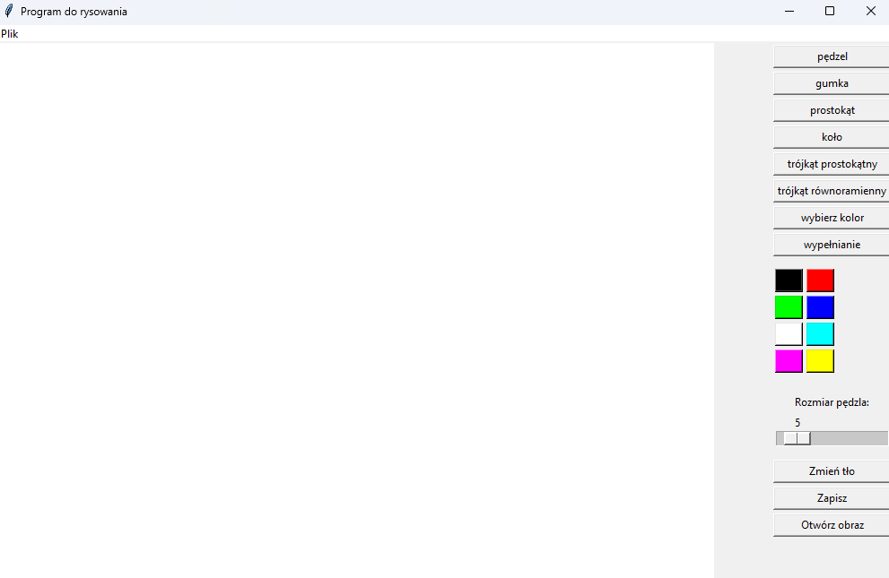

# Aplikacja do Edycji Grafiki Rastrowej - Paint-like

Polskojęzyczna aplikacja do edycji grafiki rastrowej inspirowana Microsoft Paint, stworzona w Pythonie z wykorzystaniem bibliotek OpenCV i Tkinter.

 <!-- Dodaj własny screenshot -->

## Funkcje

- **Podstawowe narzędzia:**
  - 🖌️ Pędzel z regulowaną grubością (1-50px)
  - 🧼 Gumka (automatycznie biały kolor)
  - 🎨 Paleta 8 predefiniowanych kolorów
  - 🔍 Pipeta do pobierania kolorów z obrazu

- **Kształty geometryczne:**
  - ▭ Prostokąt
  - ⬤ Koło/Okrąg
  - 📐 Trójkąt prostokątny
  - △ Trójkąt równoramienny

- **Operacje:**
  - 💾 Zapisywanie obrazu do pliku PNG
  - 📂 Wczytywanie istniejących obrazów (PNG, JPG, BMP)
  - 🖍️ Zmiana koloru tła płótna
  - ✨ Dodatkowo: Narzędzie do wypełniania obszarów (kubełek farby)

- **Zaawansowane:**
  - 🔄 Automatyczne skalowanie wczytywanych obrazów
  - 🖱️ Intuicyjna obsługa myszką
  - 🎚️ Panel boczny z szybkim dostępem do narzędzi

## Wymagania techniczne

- Python 3.7+
- Biblioteki: `opencv-python`, `Pillow`, `numpy`

## Instalacja

1. Sklonuj repozytorium:
```bash
gh repo clone czokq/Cv-paint
